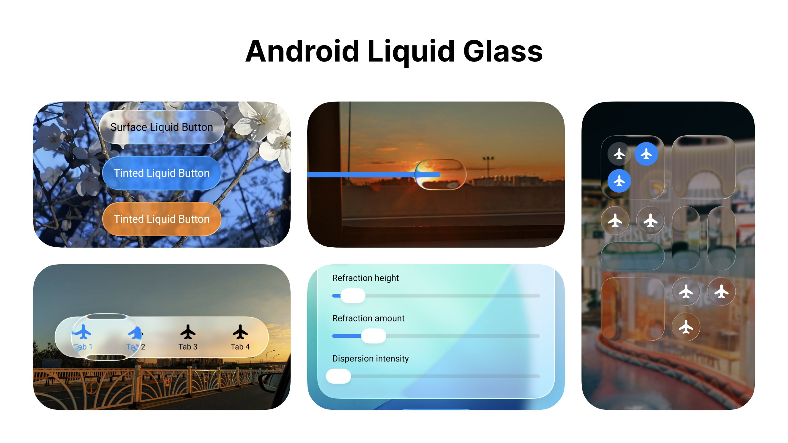
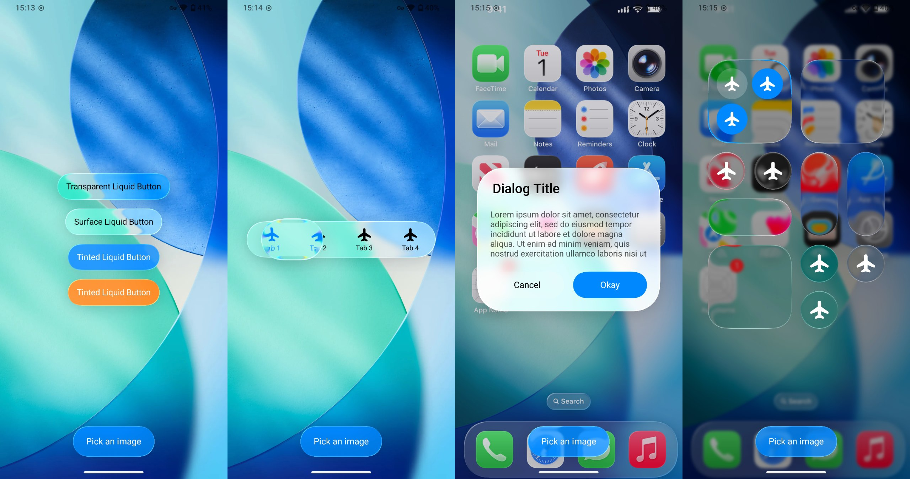
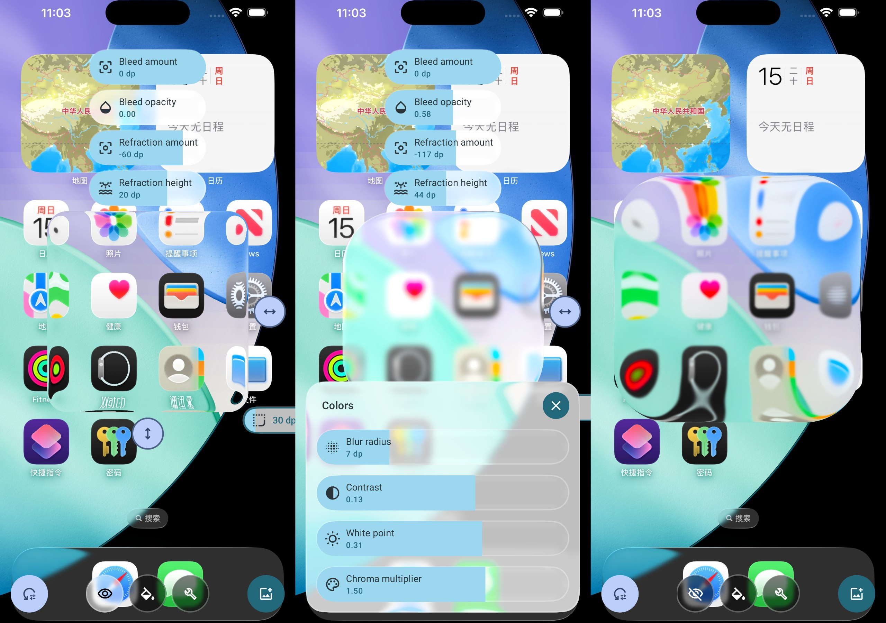
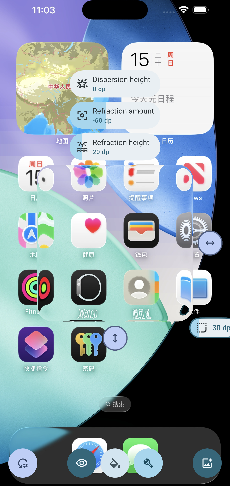

# Backdrop (Liquid Glass)



Liquid Glass effect for Android - Available for both **Jetpack Compose** and **XML Views**.

## 📖 Documentation

[](https://jitpack.io/#Kyant0/AndroidLiquidGlass)

⚠️ The library is in early alpha stage, every API may be changed, use it on your own risk.

- [Official Documentation](https://kyant.gitbook.io/backdrop)
- **[XML Quick Start Guide](./XML_QUICK_START.md)** - Get started with XML views
- **[XML Enhancements Summary](./XML_ENHANCEMENTS.md)** - See what's new in the XML version

## 🎨 Features

### Compose Version (backdrop)
- ✅ Full Liquid Glass effects with RenderEffect and RuntimeShader
- ✅ Advanced effects: Refraction, Dispersion, Vibrancy, Color Controls
- ✅ Layer-based compositing system
- ✅ Highlight variations (Specular, Ambient)
- ✅ Shadow and Inner Shadow support
- ✅ Minimum SDK: **21** (Android 5.0)

### XML Version (backdrop-xml) - **NEW!**
- ✅ **Backward compatible to API 21** (Android 5.0+)
- ✅ Same glass effects as Compose version on modern devices
- ✅ Graceful degradation on older devices
- ✅ High-level components: GlassButton, GlassSlider, GlassBottomTabs
- ✅ Interactive animations with spring physics
- ✅ Gesture handling and momentum effects
- ✅ Easy-to-use XML attributes and programmatic API
- ✅ Comprehensive documentation and examples

## 📱 API Level Compatibility (XML Version)

| API Level | Android Version | Support Level | Features Available |
|-----------|----------------|---------------|-------------------|
| 21-30 | 5.0 - 10 | ✅ Basic Glass | BlurMaskFilter, ColorMatrix, basic effects |
| 31-32 | 12 - 12L | ✅ Enhanced | RenderEffect, improved blur, color filters |
| 33+ | 13+ | ✅ **Full Featured** | **All effects**, RuntimeShader, perfect parity with Compose |

## 🚀 Quick Start

### Compose Version
See [Compose Documentation](https://kyant.gitbook.io/backdrop)

### XML Version

#### 1. Add to your layout:
```xml
<com.kyant.backdrop.xml.LiquidGlassView
    android:layout_width="300dp"
    android:layout_height="200dp"
    app:cornerRadius="24dp"
    app:refractionHeight="16dp"
    app:refractionAmount="24dp"
    app:highlightAngle="2.5"
    app:highlightType="specular">
    
    <!-- Your content here -->
    
</com.kyant.backdrop.xml.LiquidGlassView>
```

#### 2. Or use high-level components:
```xml
<com.kyant.backdrop.catalog.xml.components.GlassButton
    android:layout_width="wrap_content"
    android:layout_height="wrap_content"
    android:text="Click Me"
    app:tint="#FF0088FF"
    app:interactive="true" />
```

For complete examples, see **[XML Quick Start Guide](./XML_QUICK_START.md)**

## 🎯 Components

### Compose Components
Demo components in the [Catalog](./catalog/release/catalog-release.apk) app:
- [LiquidButton](/catalog/src/main/java/com/kyant/backdrop/catalog/components/LiquidButton.kt)
- [LiquidSlider](/catalog/src/main/java/com/kyant/backdrop/catalog/components/LiquidSlider.kt)
- [LiquidBottomTabs](/catalog/src/main/java/com/kyant/backdrop/catalog/components/LiquidBottomTabs.kt)

### XML Components - **NEW!**
Enhanced components with interactive animations:
- **[GlassButton](/catalog-xml/src/main/java/com/kyant/backdrop/catalog/xml/components/GlassButton.kt)** - Interactive button with spring animations
- **[GlassSlider](/catalog-xml/src/main/java/com/kyant/backdrop/catalog/xml/components/GlassSlider.kt)** - Slider with momentum and gesture handling
- **[GlassBottomTabs](/catalog-xml/src/main/java/com/kyant/backdrop/catalog/xml/components/GlassBottomTabs.kt)** - Bottom navigation with smooth transitions
- **[GlassIconButton](/catalog-xml/src/main/java/com/kyant/backdrop/catalog/xml/components/GlassIconButton.kt)** - Icon button variant

## 📱 Demo Apps

### Compose Catalog
- **Download**: [Catalog APK](./catalog/release/catalog-release.apk)
- **Features**: 12 demo screens showcasing all Compose effects
- **Min SDK**: 21 (Android 5.0+)



### XML Catalog - **NEW!**
- **Build Target**: `catalog-xml` module
- **Features**: **100% feature parity** with Compose catalog (12 demo screens)
- **Min SDK**: 21 (Android 5.0+)
- **See**: [Catalog Parity Report](./CATALOG_PARITY_REPORT.md) for detailed comparison

**Demo Screens in Both Catalogs:**
1. ✅ Buttons - Interactive glass buttons with animations
2. ✅ Slider - Smooth slider with momentum
3. ✅ Bottom Tabs - Tab navigation with glass effects
4. ✅ Dialog - Modal glass dialogs
5. ✅ Lock Screen - iOS-style lock screen UI
6. ✅ Control Center - Gesture-driven panel with sensor support
7. ✅ Magnifier - Magnification effects
8. ✅ Glass Playground - Interactive effect controls
9. ✅ Adaptive Luminance - Real-time color adaptation
10. ✅ Scroll Container - Scrollable glass items
11. ✅ Lazy Scroll Container - RecyclerView with glass
12. ✅ Home - Navigation menu

### Legacy Demo (Deprecated)
- **(Deprecated)** [Playground app](./app/release/app-release.apk), Android 13 and above is required.



## Comparing effects with iOS

iOS device: iPhone 16 Pro Max (emulator), using [GlassExplorer](https://github.com/ktiays/GlassExplorer)

Android device: Google Pixel 4 XL (the smallest width is adjusted to 440 dp to match the density of the iOS device)

Glass size: 300 x 300, corner radius: 30

|                             iOS                              |                               Android                                |
|:------------------------------------------------------------:|:--------------------------------------------------------------------:|
|  |  |

Complete comparisons:

- [Inner refraction](https://github.com/Kyant0/AndroidLiquidGlass/blob/530bed05f8342bf607463a775dea93a531f73f42/docs/Inner%20refraction%20comparisons.md)
- [Bleed](https://github.com/Kyant0/AndroidLiquidGlass/blob/530bed05f8342bf607463a775dea93a531f73f42/docs/Bleed%20comparisons.md)

## 💡 XML Migration from Compose

If you're currently using the Compose version and want to support XML views:

```kotlin
// Compose version
Modifier.drawBackdrop(
    backdrop = backdrop,
    shape = { ContinuousCapsule },
    effects = {
        vibrancy()
        blur(4f.dp.toPx())
        refraction(16f.dp.toPx(), 24f.dp.toPx())
    }
)
```

```xml
<!-- XML equivalent -->
<com.kyant.backdrop.xml.LiquidGlassView
    app:cornerRadius="24dp"
    app:refractionHeight="16dp"
    app:refractionAmount="24dp" />
```

```kotlin
// Add effects programmatically
liquidGlassView.apply {
    if (Build.VERSION.SDK_INT >= Build.VERSION_CODES.S) {
        addVibrancyEffect()
        addBlurEffect(4.dpToPx())
    }
}
```

## 🔧 Advanced Features (XML)

### Custom Effects
```kotlin
val effects = mutableListOf<BackdropEffect>()
effects.add(BackdropEffect.Blur(8f, 8f))
effects.add(BackdropEffect.Vibrancy)
effects.add(BackdropEffect.ColorControls(
    brightness = 0.1f,
    contrast = 1.2f,
    saturation = 1.3f
))
liquidGlassView.setBackdropEffects(effects)
```

### Interactive Animations
```kotlin
val gestureHelper = InteractiveGlassGestureHelper(view)
gestureHelper.onAnimationUpdate = { progress, tx, ty, sx, sy ->
    // Handle animation state
    liquidGlassView.setBackdropScaleX(sx)
    liquidGlassView.setBackdropScaleY(sy)
}
```

### Layer Compositing
```kotlin
// Create a layer
glassView1.layerId = "backgroundLayer"

// Reference it in another view
glassView2.setBackdropSource(BackdropSource.Layer("backgroundLayer"))
```

## 📊 Performance Considerations

- **Shader Caching**: All RuntimeShaders are automatically cached for reuse
- **API-Level Optimization**: Effects automatically adjust based on device capabilities
- **Memory Management**: Bitmaps and resources are properly recycled
- **Animation Performance**: Uses hardware-accelerated ValueAnimators

## 🤝 Contributing

Contributions are welcome! The XML version is designed to match the Compose version's capabilities while supporting older Android versions.

## 📄 License

See LICENSE file for details.

## Star history

[](https://www.star-history.com/#Kyant0/AndroidLiquidGlass&Date)

